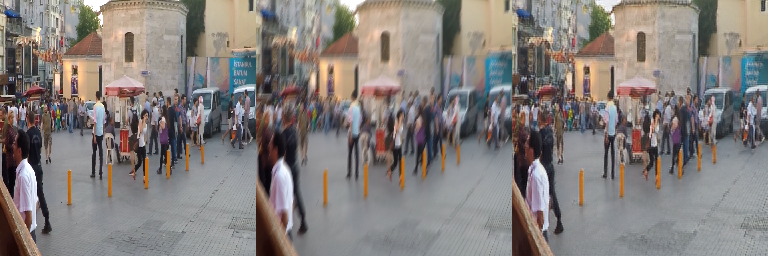

# What is this repo ?

This repository is a Keras implementation of [Deblur GAN](https://arxiv.org/pdf/1711.07064.pdf). You can find a tutorial on how it works on [Medium](https://blog.sicara.com/keras-generative-adversarial-networks-image-deblurring-45e3ab6977b5). Below is a sample result (from left to right: sharp image, blurred image, deblurred image)



# Installation

```
virtualenv venv -p python3
. venv/bin/activate
pip install -r requirements/requirements.txt
pip install -e .
```

# Dataset

Get the [GOPRO dataset](https://drive.google.com/file/d/1H0PIXvJH4c40pk7ou6nAwoxuR4Qh_Sa2/view?usp=sharing), and extract it in the `deblur-gan` directory. The directory name should be `GOPRO_Large`.

Use:
```
python scripts/organize_gopro_dataset.py --dir_in=GOPRO_Large --dir_out=images
```


# Training

```
python scripts/train.py --n_images=512 --batch_size=16 --log_dir /path/to/log/dir
```

Use `python scripts/train.py --help` for all options

# Testing

```
python scripts/test.py
```

Use `python scripts/test.py --help` for all options

# Deblur your own image

```
python scripts/deblur_image.py --weight_path=/path/to/generator.h5 --input_dir=/path/to/image/dir --output_dir=/path/to/deblurred/dir
```

# Converting to TFLite

The provided `generator.h5` file can't be converted to TFLite because it contains only the network's weights. For the moment, you must train your own generator by following the section Training above. 

To convert your own trained generator, open the file `scripts/train.py`, add the import `from deblurgan.layer_utils import ReflectionPadding2D` and then append the following code to the line `g.save_weights(os.path.join(save_dir, 'generator_{}_{}.h5'.format(epoch_number, current_loss)), True)`:
```
    # CONVERTING TO TFLITE FORMAT
    g.save(os.path.join(save_dir, 'full_generator_{}_{}.h5'.format(epoch_number, current_loss)), include_optimizer=False)

    model = tf.keras.models.load_model(
        os.path.join(save_dir, 'full_generator_{}_{}.h5'.format(epoch_number, current_loss)), custom_objects={'ReflectionPadding2D': ReflectionPadding2D})
    converter = tf.lite.TFLiteConverter.from_keras_model(model)
    tflite_model = converter.convert()
    open(os.path.join(save_dir, 'full_generator_{}_{}.tflite'.format(epoch_number, current_loss)),
         "wb").write(tflite_model)
    # /CONVERTING TO TFLITE FORMAT
```
